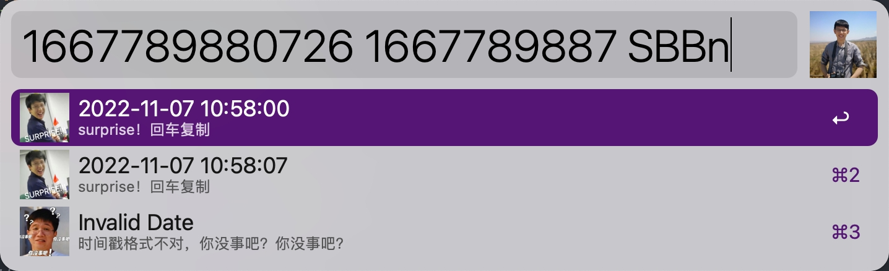

# Alfred-timestamp-convert-workflow

Alfred-timestamp-convert-workflow 是一个用于时间戳转换的 alfred workflow。

## 安装

0. 安装 nodejs

1. 在[这里](todo)下载最新的 Alfred-timestamp-convert-workflow

2. 当你导入 Alfred-timestamp-convert-workflow 时，设置 alfred 环境变量 **NODE_PATH**，用于执行 js 脚本，默认值是 **/usr/local/bin/node**

## 使用

#### `tc`: 搜索

`tc keyword` 用于转换时间戳，可以用空格分割，转换多个时间戳，当时间戳不是 10/13 位时提示错误。
